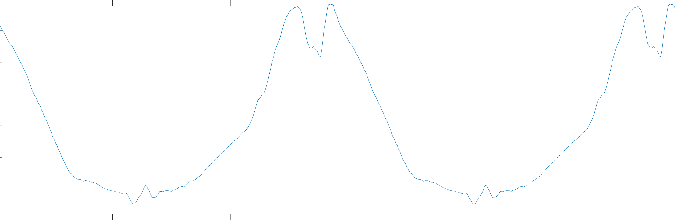
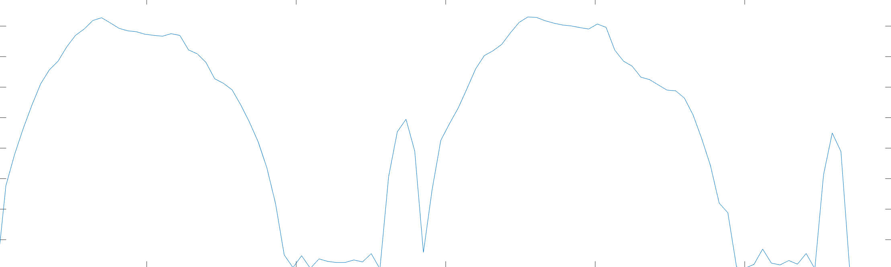
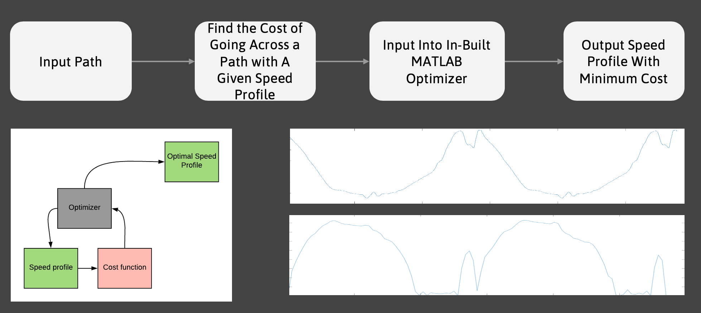
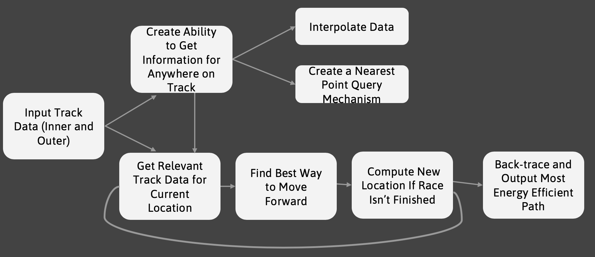
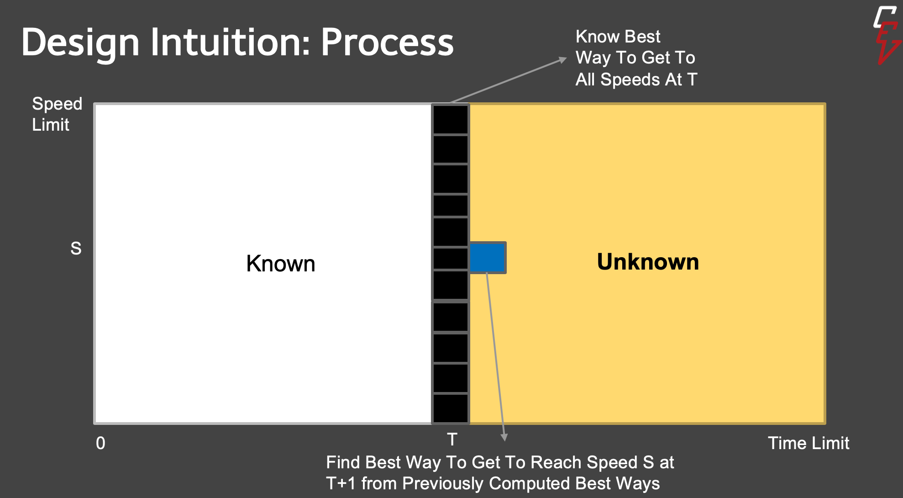
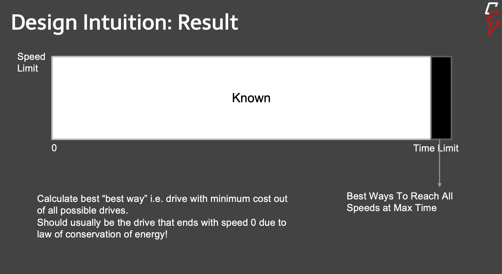

# Optimization

Aayush Chowdhry

+ [Summary](#Summary)  
    - [System Description and Goals](#system-description)  
+ [Research and Requirements](#research-and-requirements)
    - [Background Research](#background-research)
    - [Design Requirements](#design-requirements)
+ [Detailed Design](#detailed-design)
    - [System Diagram](#system-diagram)
    - [Design Overview](#design-overview)
    - [Sub-Systems](#subsystems)
        + [Track Data Interpolation and Query](#trackInterp)
        + [Cost Calculations](#costrr)
        + [Optimization and Path Computing](#opt)
+ [Reflection](#Analysis)
    - [Drawbacks](#issues)

## Summary
### System Description and Goals
The over-arching goal of the optimization project is to take in some track data as an input and output the most way to traverse the track. In the previous years, this included assuming an input path and given the best speed profile as output. The following is an example of the speed profile yielded by the old app for last year's track data and some approximate car parameters.

For example, for this track data:  the old script yielded the following as the most optimum speed profile: 

However, over the course of the year, several potential issues were identified with this old model. Primarily, one cannot assume an input path as all the data acquired pre-drive is inner-track data and outer-track data. Second, what if during the course of the race, the driver changes paths from the prescribed path (very likely to happen)? Then the result from the app would become redundant. Hence, to find the most optimum way to traverse a track, the following primary goals were identified:

1) Finding the best path to take in a given track.

2) Finding the most energy efficient way to traverse the best path.

3) Have the ability to recompute both as and when needed.

## Research and Requirements 
### Background Research 

Physics: Motion along an incline plane, motion in fluids, torque, efficiency, kinematics and some basic calculus.

Computer Science: Trees, KDTrees, Time-Complexity Analysis, Dynamic Programming, Inheritance and Subclassing.

### Design Requirements 

The kernel design requirements for the project are:

1) An interpolation and query mechanism for the given track data to have to the ability to get information for any place in the track.

2) An energy calculation mechanism in order to find the amount of energy required to move between two points.

3) A cost mechanism in order to ensure that the car moves forward and traverses the path instead of staying at the same spot and yielding 0 energy.

4) A path computing mechanism that, within the given time limit, computes a path for the car to take in a given track and the speed profile with which to traverse it.

## Detailed Design 
### System Diagram 

The following was the system diagram for previous years: 

The new system diagram that fulfills the new goals for the project is: 

### Design Overview 

The basic intuition behind the design of the algorithm is shown in the following figure: 
As shown the way to go about calculating an optimum path and speed profile is to look at the best ways to attain all possible speeds at all possible times. The process, simply explained, is as follows: start at 0 speed and 0 time; for all possible speeds at 1, calculate the most energy efficient way to reach that speed from 0 (looking at paths from all possible steering angles); then for all possible speeds 2, compute the best way to reach it from the speeds at one and store a back pointer to the optimal previous path and speed; repeat this process until you have the best way to reach all possible speeds at the maximum time. The result, then, should look something like this: From the result, we can look at the best possible path (the path with the least cost at max time) and backtrace that path and speed profile to yield the required results from the app. This concludes the basic design of the system.

### Sub-Systems
#### Track Data Interpolation and Query 

Potential designs for a track data interpolation and query mechanism includes using a gridded interpolant or a KDTree. A gridded interpolant is a built in feature in most programming languages that allows query of any point by extrapolating points from a given data set. A KDTree is a modified BST where each layer of the tree is sorted with respect to the x and y coordinate alternatively. This also allows query of any point, but simply returns an avergae of the nearest points.

For data interpolation, the KDTree method was chosen since it yielded in a much faster query mechanism. It was also chosen as employing this algorithm would result in much quicker and easier translation of code into other languages and employability of extra features such at mechanism to query vertical angle and an inbuilt interpolation of the track data.

A KDtree is a binary tree in which every leaf node is a k-dimensional point. Every non-leaf node can be thought of as implicitly generating a splitting hyperplane that divides the space into two parts (half-spaces). Points to the left of this hyperplane are represented by the left subtree of that node and points to the right of the hyperplane are represented by the right subtree. The hyperplane direction is chosen in the following way: every node in the tree is associated with one of the k dimensions, with the hyperplane perpendicular to that dimension's axis. For example, if for a particular split the "x" axis is chosen, all points in the subtree with a smaller "x" value than the node will appear in the left subtree and all points with larger "x" value will be in the right subtree. In such a case, the hyperplane would be set by the x value of the point, and its normal would be the unit x axis. Then, the next split would happen in the "y" axis in both the left and right subtrees and so on and so forth as shown here: 

In our particular case, since our required query points are simply two dimensional points, each layer of the KDTree is divided by x and y values alternatively. Then, when a point is queried, the tree the search moves down the tree recursively (it goes left or right depending on whether the point is lesser than or greater than the current node in the split dimension), and
once the algorithm reaches a node whose distance from the given point is lowest, it returns that point. This can also be done to return a set of closest points.

#### Cost Calculations 

Potential designs for a cost calculating mechanism included calculating cost as a sum of energy and the distance from the finishing point in order to ensure progress towards the finishing point, or a sum of energy and the difference between the distance covered and average distance that should be covered in the given time.

For a cost calculating mechanism, a sum of energy and difference from average distance to be covered was chosen since it was realized that if distance from the finish line was a factor in cost then the car would want to finish the race as soon as possible which would not always yield in a more energy efficient path and speed profile for traversal.

The basic design for the function that calculates the cost of moving from one point to another on the track should be:

cost = f(energy) + f(distanceCovered)

since it must be a function the energy consumed and the progress made towards completion of the race. In the current implementation, energy is a function of the speed and vehicle parameters, while the distance factor in cost is simply the difference between the distance covered and the average distance the car should cover. That is to say:

cost = energy+(distanceCovered-averageDistanceToCover)^2

The energy function for calculating the energy spent in moving between two points is simply a product of the total force exerted by the car and the distance between the two points.

energy = force \* distCovered

To calculate the total force exterted by a particular vehicle, the following computation is done:

force = mass * acceleration + airResistance + corneringResistance           + rolling_resistance + slope_force

AirResistance is a function of average velocity over the distance covered such that: airResistance = coefficient_of_linear_drag * avg_velocity + coefficient_of_turbulent_drag * avg_velocity^2. RollingResistance is basically the average friction between the car and the ground on an inclined plane experienced while covering the distance: rollingResistance = mass * gravity * cos(verticalAngle). slopeForce is just the average downward force due to gravity on an inclined plane: slopeForce = mass * gravity * sin(verticalAngle). CorneringResistance is slightly more complicated and is left out of the computations for now.

Since we already have data about the previous speed and the current speed and steering angle, we can calculate where we are going to be on the track if we take the given path and hence, we can calculate the acceleration, verticalAngle of the the path followed and the other required components of the above calculations.

#### Optimization and Path Computing 

Optimization and Path Computing is primarily done using a dynamic programming algorithm. The aforementioned intuition behind the system design is essentially the underlying mechanism for dynamic programming. The basic process one starts at 0 with an empty path, then it looks at all possible speeds and iterates over all possible steering angles to compute the minimum cost steering angle for which to move forward with the given speed from 0. At every speed at time = 1, there is also data of it's current location and previous speed store. Essentially, there is an implicit best path to take to reach that speed at that time stored. Now, for time = 2, for every speed, the cost to reach it from all possible steering angles and all possible speeds is calculated and (for each speed) a minimum cost is found and stored at the corresponding iteration of the cost array. With this, also, implicitly, from all possible previous path, the best path is found to reach the given speed at the given time. This process is carried out until time reaches the time limit, at which point there as as many different paths as there are speeds. Since we have information about the cost of the various paths, we find the speed at maximum time with the minimum cost in reaching it and backtrace the path from there. This path is then the most efficient way to traverse the track with the corresponding the corresponding speed profile.

Since the cost function already makes sure that progress is being made toward completion of the race the two primary concerns in this design are how to ensure that the car stays within the track and stops after finishing the race, and how to store the information for all the speeds at all the times in an organized fashion.

For the latter, potential designs include having separate distance, cost, speed array, steering angle, and coordinate arrays in order to get data at each point, to compute data for the next point and finally arrive at a minimum cost path. The other option was compromise on space efficiency and create a class that stores the required information for every speed at any given time. For the purposes of readability of code and better organization, a Cost Node class was created with respective getters and setters for cost, heading, steering angle, speed, time, coordinates etc.

To ensure that the car stays within bounds, the new X and Y for each speed and steering angle was calculated and if the X was within the max and min X in the track data, and the Y was also within the max and min Y in the track data, the car was considered to be within the track. If the car wasn't in the track, the cost was made infinity and hence, such a path would never be chosen. Similarly, if the distance covered became more than the maximum distance to be covered to traverse the track, the cost was made infinity to ensure that upon completion the car stopped.

## Analysis and Reflection
The kernel drawbacks in this design is that the costing seems rather arbitrary and it perhaps isn't the best way to cost since except for limits on steering angles nothing is stopping the car from going back and forth. The second striking drawback is that the speed of the algorithm is currently pretty slow and is impractical to be employed as a real-time update algorithm. The third drawback is that there is no way to definitively test the results until now. Moving forward, I think its important to create a set of tracks for which we have an expected minimum cost path (for given vehicle parameters) that the algorithm should yield as a testing mechanism. It is also important to work on employing methods to decrease the runtime of the algorithm and to try various costing mechanism to see which yields the best results.
